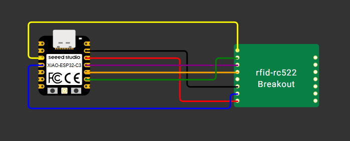

# Système de Gestion d’Accès RFID avec ESP32

## 📑 Table des matières

1. [Introduction](#introduction)
2. [Matériel utilisé](#matériel-utilisé)
3. [Fonctionnement général](#fonctionnement-général)
4. [Code embarqué (ESP32)](#code-embarqué-esp32)
5. [API et Interface Web](#api-et-interface-web)
6. [Base de données](#base-de-données)
7. [Déploiement & Hébergement](#déploiement--hébergement)

---

## 🧠 Introduction

Dans le cadre d’un projet de prototypage électronique, nous avons développé un système complet de gestion d’accès par badge RFID.  
Ce projet permet :

- D'autoriser ou refuser l'accès à une salle via un badge RFID
- De gérer les badges (utilisateurs ou administrateurs)
- De définir des horaires d’accès pour chaque salle
- De contrôler les accès via une API et une interface web

---

## 🔌 Matériel utilisé

| Composant        | Description                                 |
|------------------|---------------------------------------------|
| ESP32            | Microcontrôleur avec Wi-Fi intégré          |
| RFID-RC522       | Lecteur de badges RFID à 13.56 MHz          |
| Fils Dupont      | Connexions entre ESP32 et modules externes  |
| (optionnel) LCD  | Affichage des statuts (non utilisé ici)     |

---

## ⚙️ Fonctionnement général

1. Le badge est scanné par le module RFID.
2. L’ESP32 envoie l’UID à une API Flask via Wi-Fi.
3. L’API vérifie si le badge est autorisé.
4. L’accès est autorisé ou refusé selon :
   - Le rôle (admin/user)
   - Les horaires définis pour la salle
5. Si le badge est un admin, l’ESP32 permet aussi d’ajouter ou supprimer des badges.

### 🖼️ Schéma du montage électronique


---

## 📟 Code embarqué (ESP32)

Le code de l’ESP32 permet de :

- Se connecter au Wi-Fi
- Lire l’UID des badges RFID
- Envoyer les données à l’API
- Afficher sur le moniteur série :
  - Accès autorisé / refusé
  - Badge inconnu
  - Badge administrateur détecté

---

## 🧩 API et Interface Web

L’API a été développée en **Python (Flask)**. Elle offre plusieurs endpoints pour gérer :

- Les utilisateurs
- Les rôles (admin/user)
- Les salles
- Les horaires d’accès

### 🌐 Interface graphique web

Développée en **HTML/CSS/JS**, elle permet de :

- Ajouter/supprimer des badges
- Créer des salles
- Définir ou modifier les horaires d’accès
- Consulter :
  - Les badges enregistrés
  - L’état en temps réel des salles (ouverte/fermée)
- Supprimer une salle

---

## 🗄️ Base de données

Nous utilisons SQLite pour stocker les données localement :

- Table `users` : UID, nom, rôle
- Table `rooms` : nom des salles
- Table `acces_horaire` : horaires par salle

---

## ☁️ Déploiement & Hébergement

L’API est déployée sur **Render** :  
[https://ton-url-render.onrender.com](https://ton-url-render.onrender.com)

⚠️ À noter :
- Le service Render gratuit se met en veille après 15 min d’inactivité.
- Les données SQLite ne sont pas persistantes, il est recommandé de travailler en local pour les tests importants.

---


### 💼 Projet réalisé par : **Groupe 15**

---

# 🚀 Badge RFID – Code embarqué ESP32-C3

Ce dossier contient le code embarqué destiné à être flashé sur un **ESP32-C3**.  
Il interagit avec un lecteur **RFID-RC522** pour envoyer les UID des badges scannés à une API Flask.

---

## 🔧 Dépendances PlatformIO

Assure-toi d’avoir ces dépendances dans `platformio.ini` :

```ini
[env:esp32-c3-dev]
platform = espressif32
board = esp32-c3-dev
framework = arduino
monitor_speed = 115200
lib_deps =
  miguelbalboa/MFRC522@^1.4.10
